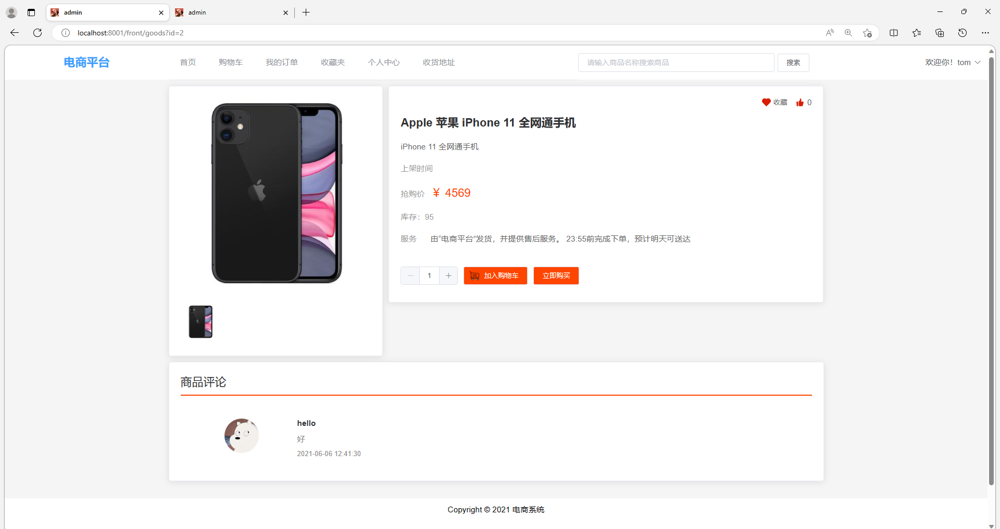

# 商城系统网站

运行环境:idea或eclipse vscode 数据库:mysql

## 一、介绍

基于SpringBoot+Vue的前后端分离商城系统网站

语言：java

后台： SpringBoot + Mybatis-plus + Mybatis + Hutool工具包 + lombok插件

前台：Vue + Vue Router + ELementUI + Axios

功能：首页推荐、轮播图管理、商品、订单、购物车、商品评论、商品评论点赞、商品收藏、商品点赞、订单支付、公告。

角色：管理员、用户

## 二、系统运行界面

## 三、系统部分功能界面截图





## 四、视频演示

```
链接：https://pan.baidu.com/s/1jfMjv_ymPQJ8dXFMOfTaEA?pwd=8g5x

提取码：8g5x

--来自百度网盘超级会员V6的分享

```

## 五、 9.9￥ 获取完整源码+sql，附赠11000字论文参考，需要加Q：3808981644 备用Q：3577148218

